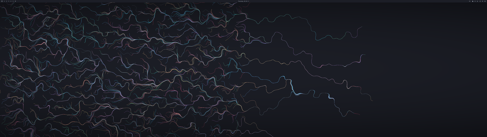
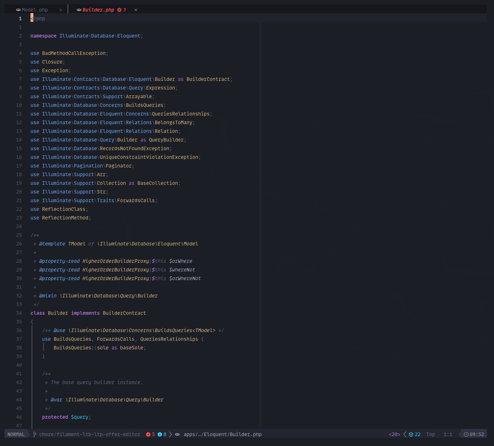
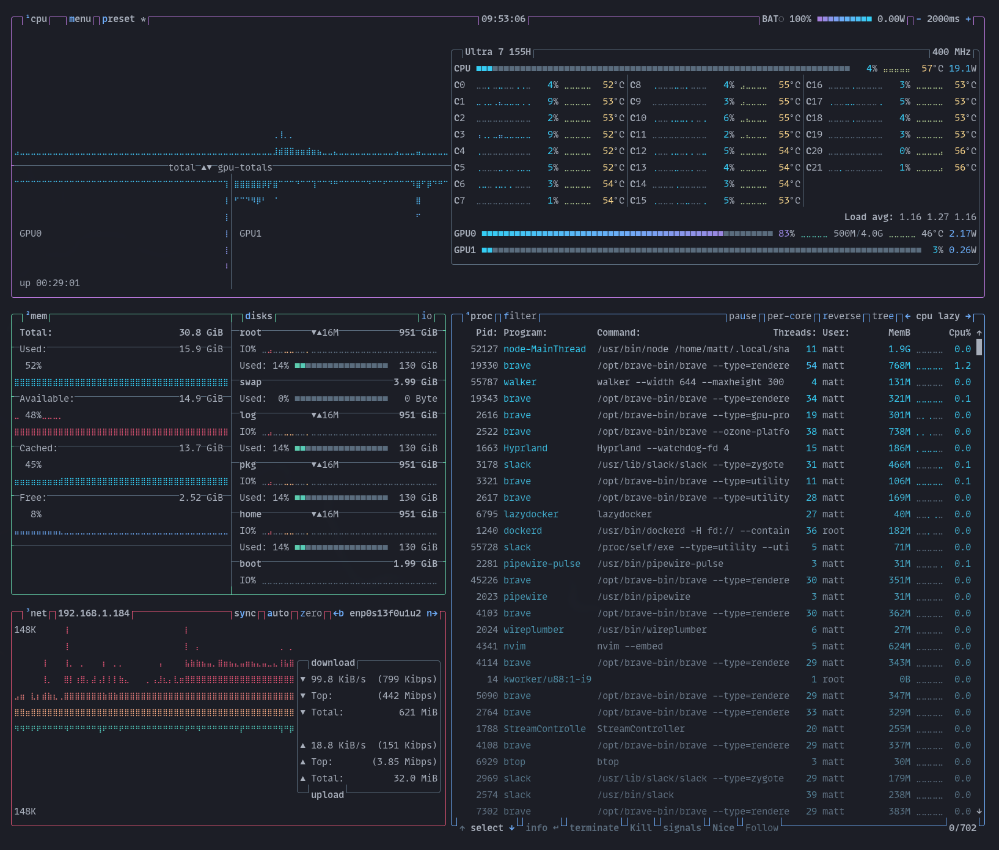
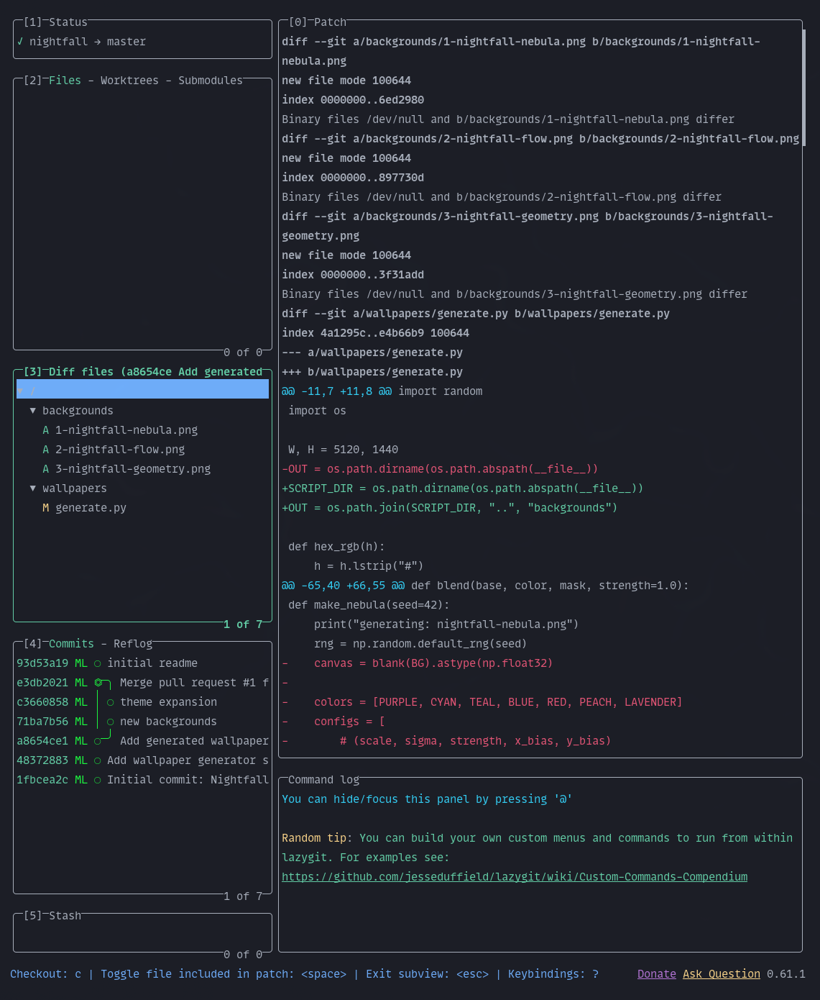
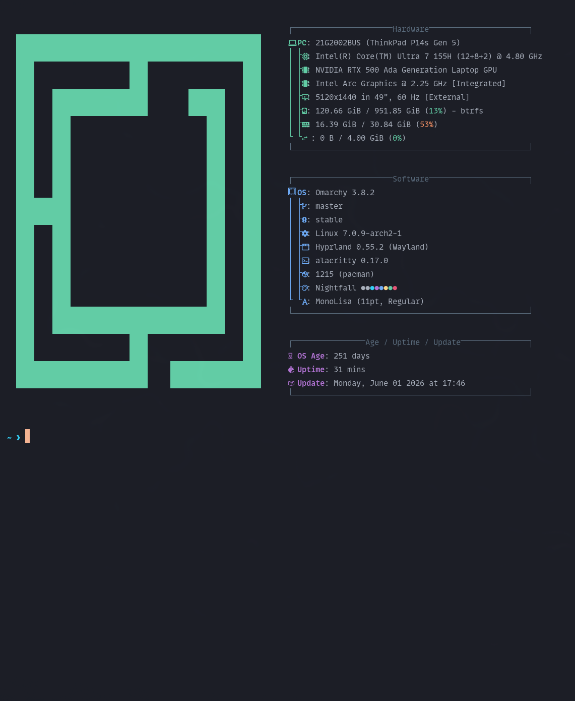

<p align="center">
  
</p>

# Nightfall

An [Omarchy](https://omarchy.org) theme inspired by the colors of the night sky — purple, cyan, and teal accents over a deep `#1c1e26` background.

Originally a JetBrains theme by [@coeiico](https://github.com/coeiico/jetbrains-nightfall-theme) (now maintained by me); this is the port to Omarchy.

## What's included

- **Palette** (`colors.toml`) — drives auto-theming for terminals (Alacritty, Ghostty, Kitty, Foot), Obsidian, Chromium, waybar, mako, walker, hyprland/hyprlock, and more
- **Neovim** (`neovim.lua`) — installs [`nightfall.nvim`](https://github.com/mattlibera/nightfall.nvim) via LazyVim
- **btop** (`btop.theme`) — system monitor colors with a teal → yellow → red gradient
- **VS Code** (`vscode.json`) — points at [`qatoqat.nightfall-theme`](https://marketplace.visualstudio.com/items?itemName=qatoqat.nightfall-theme)
- **Icons** (`icons.theme`) — `Yaru-purple`
- **Wallpapers** (`backgrounds/`) — seven original wallpapers generated with `wallpapers/generate.py`
- **Unlock logo** (`unlock.png`) — OMARCHY in rainbow palette

## Screenshots

<p align="center">
  
</p>

| **Neovim** | **btop** |
| :---: | :---: |
|  |  |
| **Lazygit** | **Fastfetch** |
|  |  |

## Install

```bash
omarchy theme install https://github.com/mattlibera/omarchy-nightfall-theme.git
```

## Wallpapers

The seven wallpapers in `backgrounds/` are generated procedurally — nebula, flow field, geometry, aurora, starfield, topographic, and mesh gradient. Regenerate or add your own with:

```bash
python wallpapers/generate.py
```

Requires `numpy`, `pillow`, and `scipy`.
